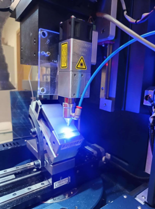
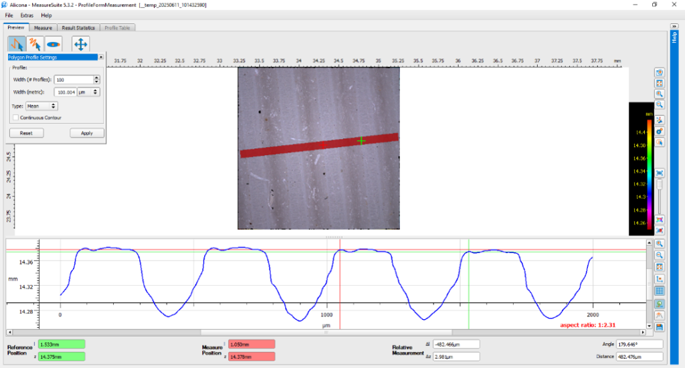
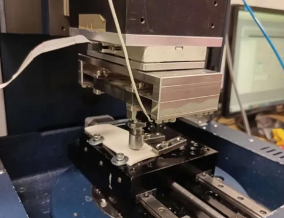
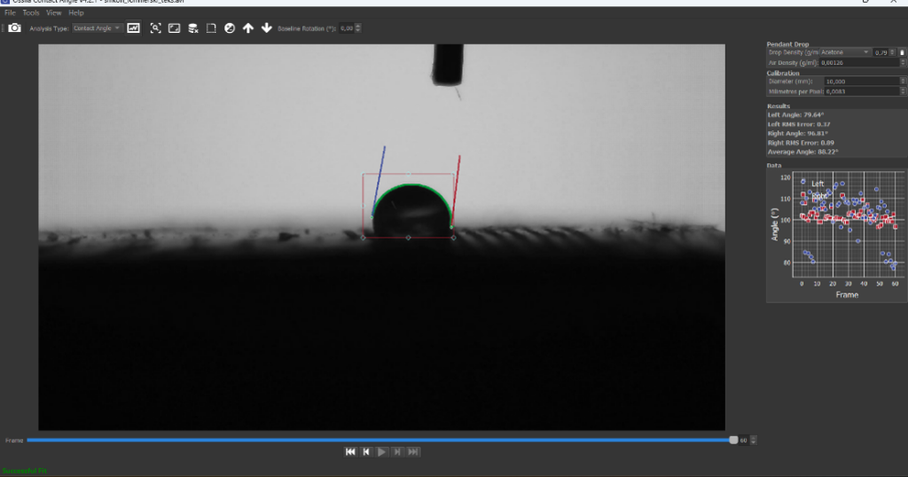
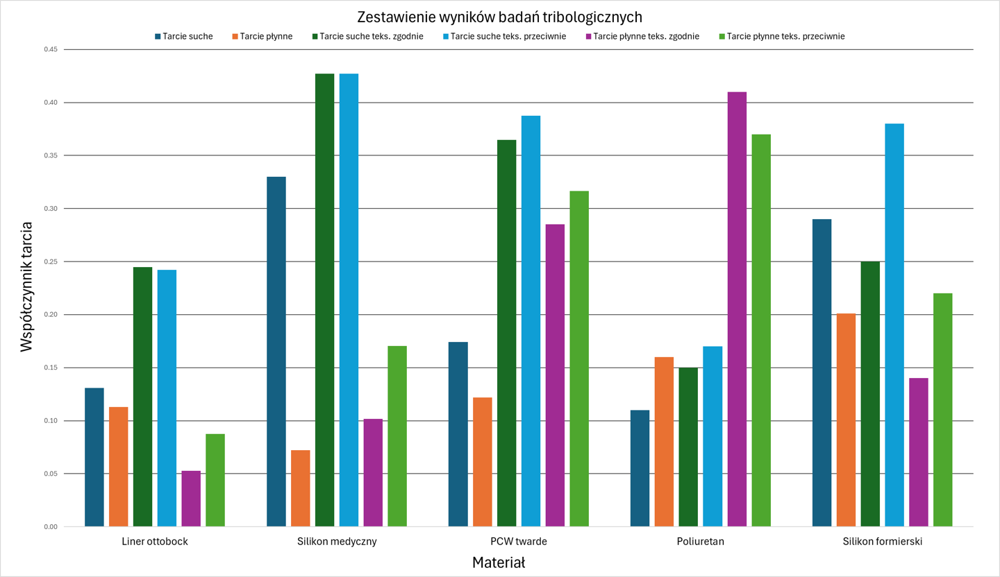

# Projekt i optymalizacja drenu pooperacyjnego

Repozytorium zawiera streszczenie pracy magisterskiej dotyczącej projektu i optymalizacji drenu pooperacyjnego z powierzchnią o dwukierunkowym współczynniku tarcia. Celem pracy było opracowanie mikrostruktury, która poprawia kontrolę położenia drenu w tkankach, ułatwia jego usuwanie i może ograniczać ryzyko powikłań. Szczególną uwagę zwrócono na właściwości tribologiczne i zwilżalnościowe powierzchni polimerowych, które odgrywają kluczową rolę w procesach gojenia oraz w kontakcie z płynami ustrojowymi.  

Do modyfikacji powierzchni zastosowano metodę grawerowania laserowego. Technika ta umożliwia precyzyjne kształtowanie mikrostruktur, których geometria wpływa na współczynnik tarcia i stopień zwilżalności. Badania przeprowadzono na kilku materiałach powszechnie wykorzystywanych w produkcji drenów, między innymi na silikonach, poliuretanie oraz polichlorku winylu.  

  

W ramach badań zastosowano zestaw metod analitycznych. Mikroskopia optyczna i konfokalna pozwoliła na ocenę topografii i jakości uzyskanych struktur, a także na określenie ich powtarzalności i głębokości. Badania zwilżalności przeprowadzono z użyciem goniometru, analizując kąty zwilżania kropli wody na zmodyfikowanych powierzchniach. Z kolei testy tribologiczne na tribometrze umożliwiły określenie współczynnika tarcia zarówno w warunkach suchych, jak i w obecności środka smarującego.  

   

Uzyskane wyniki potwierdziły, że mikrostruktury wytworzone techniką grawerowania mogą skutecznie nadawać powierzchniom kierunkowy charakter tarcia. Szczególnie korzystne efekty zaobserwowano dla silikonów, które charakteryzowały się stabilnością struktury oraz dużą powtarzalnością wyników. W tych przypadkach możliwe było uzyskanie wysokiego tarcia w jednym kierunku, przy jednoczesnym jego zmniejszeniu w kierunku przeciwnym, co odpowiada założeniom projektowym. Dodatkowo zauważono poprawę właściwości hydrofobowych, która może przyczyniać się do ograniczenia ryzyka infekcji w miejscu rany.  

Przeprowadzona analiza pozwoliła także wskazać ograniczenia niektórych materiałów. W przypadku polichlorku winylu obserwowano nieregularność i miejscowe uszkodzenia powierzchni wynikające z procesu spalania pod wpływem wiązki laserowej. Poliuretan natomiast charakteryzował się mniejszą podatnością na precyzyjne kształtowanie mikrostruktur.  

  

Wnioski z badań potwierdzają, że grawerowanie laserowe jest obiecującą technologią w zakresie modyfikacji powierzchni drenów medycznych. Otrzymane struktury pozwalają na kontrolowanie właściwości tribologicznych i zwilżalnościowych w sposób ukierunkowany, co może przełożyć się na praktyczne korzyści w chirurgii i opiece pooperacyjnej. Dodatkowym rezultatem pracy był projekt stanowiska umożliwiającego teksturowanie powierzchni drenów w sposób powtarzalny i możliwy do wdrożenia w warunkach laboratoryjnych oraz przemysłowych.  

Podsumowując, opracowana koncepcja stanowi krok w stronę nowych rozwiązań biomedycznych, które mogą poprawić efektywność procesu gojenia ran i komfort pacjentów. Jednocześnie wyniki wskazują na konieczność dalszych badań w warunkach bliższych rzeczywistym, obejmujących testy biologiczne i kliniczne.  

---

